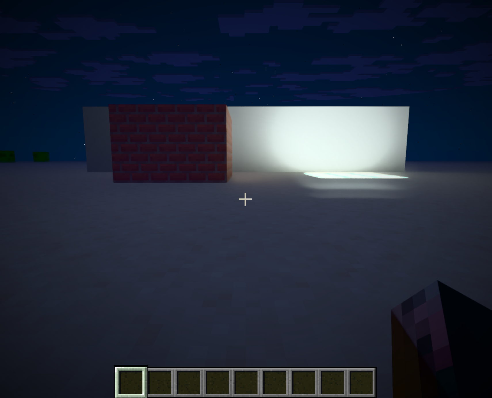

# Linux port

Experimental Fabric port based on upstream commit `351bd29`. The original renderer is by
Gabrieli2806, building on Radiance/MCVR by LJIONG and Interstellarss. This fork focuses on
Linux integration and preserves the upstream licences and credits.

## Install in Prism Launcher

1. Create a separate **Minecraft 26.3** instance and install **Fabric Loader 0.19.5** or later.
2. Add **Fabric API 0.161.0+26.3** and the Linux JAR from this fork's
   [releases](https://github.com/danrtz/radiante-linux/releases).
3. Use **Java 25**, a current Vulkan driver with hardware ray tracing, and the **Vulkan** graphics backend.
4. Start with a test world, a modest render distance (6–8 chunks) and a 60 FPS cap.
5. **F6** opens Radiante settings; **F7** switches ray tracing on/off. FSR with NRD is the tested preset.

Keep Sodium, Iris and other replacement renderers out of this instance. Do not install the
Windows and Linux Radiante JARs together. Back up worlds before experimenting with mods.
There is no external shader pack to install: `vanilla-pt` is bundled.

The release JAR is **Linux x86_64, built on current Arch Linux**. It is not a universal Linux
binary. It links to system `shaderc_shared`, Vulkan, zlib-ng, bzip2, xz, OpenSSL, libstdc++ and
glibc. On Arch, keep the system fully updated and install `shaderc`, `vulkan-icd-loader`,
`zlib-ng`, `bzip2`, `xz`, `openssl` and your GPU's Vulkan driver (`vulkan-radeon` for AMD).
Shaderc also brings its matching glslang/SPIR-V dependencies. Older distributions can have
incompatible library versions; build from source there instead of copying library files around.

## Build

Required: a Java 25 **JDK**, a C++23 compiler, CMake, Ninja, Git, Python 3, Vulkan headers/loader,
shaderc (including its shared library and headers), glslang, and normal development tools.
The build downloads Gradle/Minecraft dependencies and the vendored SDKs' build dependencies;
allow several GB of disk space and network access. The first build can take several minutes.

Example build dependencies on Arch (plus Java 25 and your Vulkan driver):

```sh
sudo pacman -S --needed base-devel cmake ninja git python vulkan-headers vulkan-icd-loader shaderc glslang zlib-ng

git clone https://github.com/danrtz/radiante-linux.git
cd radiante-linux
export JAVA_HOME=/path/to/java-25-jdk
BUILD_JOBS=4 ./scripts/build-linux.sh
```

Output: `fabric/build/libs/radiante-fabric-0.3.0-linux.2+26.3.jar`.
The script builds and installs the Linux native library before packaging the Fabric JAR.
It enables FSR and NRD, and disables Windows Streamline and XeSS. No proprietary Windows DLLs
are included. SDK licences and third-party notices remain in the source tree and JAR.
Use separate working copies for Windows and Linux packaging so staged native resources do not mix.

## What changed

- Load `libcore.so` on Linux, retaining `core.dll` on Windows; skip Windows-only DLL loading.
- Use system Vulkan/shaderc, reject unresolved native symbols at link time, and avoid linking
  to a particular JDK's JVM/AWT libraries.
- Fix disabled Streamline/XeSS build paths.
- Quote FSR shader permutation arguments so Bash does not expand `{0,1}` into separate arguments.
- Compile NRD shaders and add a Linux build script.
- Make the sampler cache weak and device-specific. The original strong cache kept samplers
  alive until after Minecraft destroyed its Vulkan device, causing a crash on exit in testing.

- Stop and join the native diagnostic watchdog before closing the Vulkan device. Its detached
  thread could otherwise query a destroyed device while other mods finished shutting down.

## Validation — 28 September 2026

Test system: Arch Linux x86_64, Hyprland on native Wayland, RX 7900 XT (RADV NAVI31),
Mesa 26.2.3, Java 25.0.1, Minecraft 26.3, Fabric 0.19.5 and Fabric API 0.161.0+26.3.
Build system: GCC 16.2.1, glibc 2.44, CMake 4.4.3 and shaderc 2026.3.

- Release native build and Fabric packaging passed.
- `ldd -r` found no missing libraries or unresolved symbols; the installed library has no build-directory RPATH.
- JAR contains `libcore.so`, shaders and modules, with no Windows DLLs.
- Development client rendered a test scene with ray tracing, NRD and FSR 3.1.4.
- Ray tracing was switched off and back on, and emissive lighting was checked at night.
- A shutdown crash was reproduced, fixed in the sampler cache, and followed by a successful clean exit.
- The packaged JAR also loaded and rendered through a separate Prism instance, with RT off/on and shutdown tested.

Nighttime emissive-lighting check in the installed Prism instance:



An adapted local Fabulously Optimized setup also includes Lithium, FerriteCore, ModernFix,
Mod Menu, Zoomify and other convenience mods. Sodium, Iris and their dependent mods are omitted,
as are additional culling/immediate-rendering and raster dynamic-lighting mods. This is not an
unmodified or officially supported Fabulously Optimized pack, and individual mod features have
not all been validated.

Testing that setup with a -100 mV GPU undervolt produced a graphics-ring timeout after a resource
reload, followed by a GPU reset and compositor crash. At stock GPU settings, the same build and
mod set passed the original sequence and a second run with three reloads and world re-entry,
without GPU faults or native shutdown crashes. A third test streamed real terrain, reloaded
resources and toggled ray tracing under high GPU load, then exited without a fault. All three
launch-to-exit runs passed at stock settings. Validate at stock settings first; these results
do not establish undervolting as the sole possible cause of a hang.

These are short functional tests, **not** long-session stability tests or performance benchmarks.
First use compiles shaders and can pause for several seconds.
NVIDIA/Intel GPUs, DLSS, other distributions, X11, HDR, multiplayer, Distant Horizons and
NeoForge/Forge remain untested. Streamline frame generation/Reflex and XeSS are disabled.
Report Linux-specific problems to this fork with the driver version and a redacted game log.
